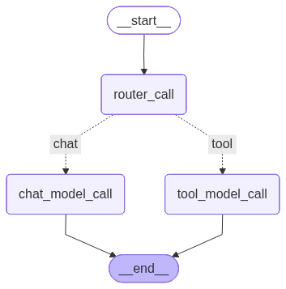

# Lang Agent Chat API

这是一个基于FastAPI的聊天API服务，使用OpenAI格式的请求来调用pipeline.invoke方法进行聊天。

## 安装依赖

```bash
# recommended to install as dev to easily modify the configs in ./config
python -m pip install -e .
```

## 环境变量

make a `.env` with:

```bash
ALI_API_KEY=<ALI API KEY>
ALI_BASE_URL="https://dashscope.aliyuncs.com/compatible-mode/v1"
MCP_ENDPOINT=<OBSOLETE>
LANGSMITH_API_KEY=<LANG SMITH API KEY> # for testing only; location of where dataset is stored
```

## 运行服务

```bash
# for easy debug; streams full message internally for visibility
python fastapi_server/fake_stream_server_dashscopy.py

# for live production; this is streaming
python fastapi_server/server_dashscope.py

# start server with chatty tool node; NOTE: streaming only!
python fastapi_server/server_dashscope.py route chatty_tool_node

# this supports openai-api; 
python fastapi_server/server_openai.py
```
see sample usage in `fastapi_server/test_dashscope_client.py` to see how to communicate with `fake_stream_server_dashscopy.py` or `server_dashscope.py` service  

### Openai API differences
For the python `openai` package it does not handle memory. Ours does, so each call remembers what happens previously. For managing memory, pass in a `thread_id` to manager the conversations
```python
from openai import OpenAI

client = OpenAI(
        base_url=BASE_URL,
        api_key="test-key"  # Dummy key for testing
    )

client.chat.completions.create(
            model="qwen-plus", 
            messages=messages,
            stream=True,
            extra_body={"thread_id":2000}  # pass in a thread id
        )
```


## Runnables
everything in scripts: 
- For sample usage see `scripts/demo_chat.py`.
- To evaluate the current default config `scripts/eval.py`
- To make a dataset for eval `scripts/make_eval_dataset.py`


## Registering MCP service
put the links in `configs/mcp_config.json`


## Graph structure
Graph structure:

  
We choose this structure to overcome a limitation in xiaozhi. Specifically, both normal chatting and tool use prompts are deligated to one model. That leads to degregation in quality of generated conversation and tool use. By splitting into two model, we effectively increase the prompt limit size while preserving model quality.

## Modifying LLM prompts
Refer to model above when modifying the prompts.  
they are in `configs/route_sys_prompts`
- `chat_prompt.txt`: controls `chat_model_call`
- `route_prompt.txt`: controls `router_call`
- `tool_prompt.txt`: controls `tool_model_call`
- `chatty_prompt.txt`: controls how the model say random things when tool use is in progress. Ignore this for now as model architecture is not yet configurable